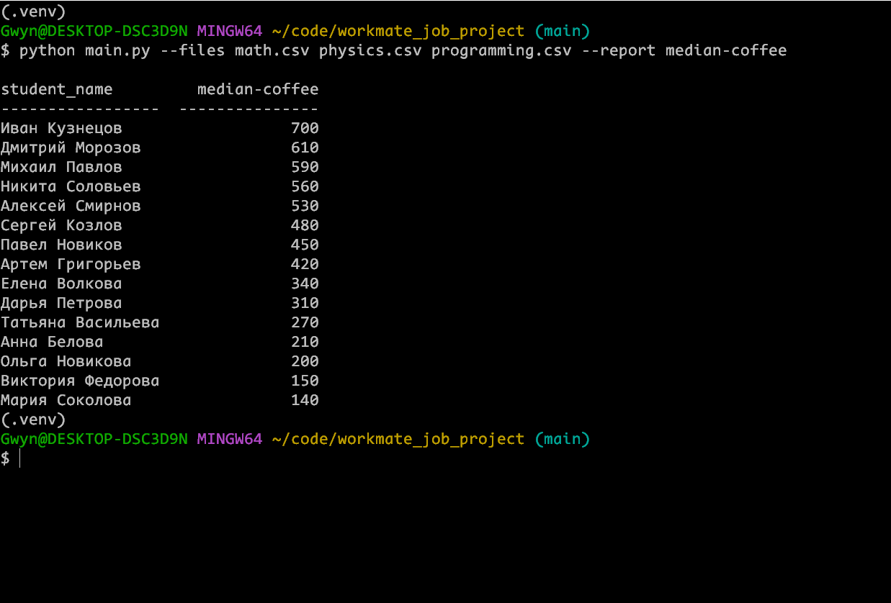
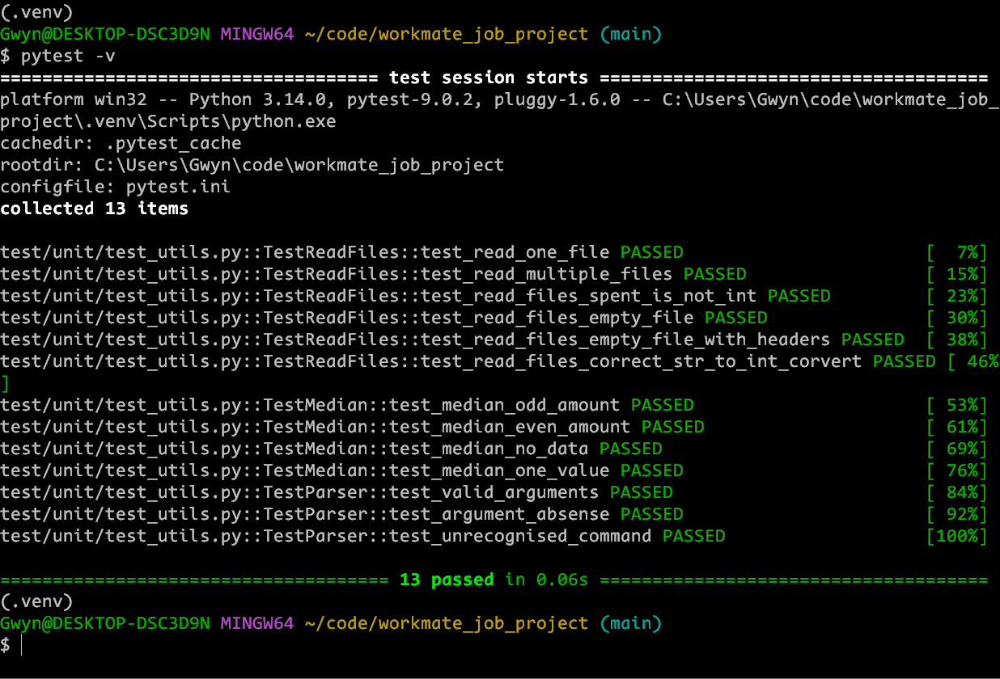

# workmate-test-project
Проект для workmate

## Описание
Программа принимает данные о тратах студентов на кофе во время подготовки к экзаменам. По каждому экзамену свой отчет. Программа читает эти отчеты и формирует один общий, в котором содержится информация о медианной трате студентов на кофе.

## Использование
Сначала следует активировать виртуальное окружение:
```cmd
.venv\Scripts\activate
или
source .venv/Scripts/activate
```
Использование:
```cmd
python main.py --files math.csv physics.csv programming.csv --report coffee_spent
```
Запуск тестов pytest:
```cmd
pytest -v
```
Скриншоты:
### Работа программы:

### Запуск тестов:

